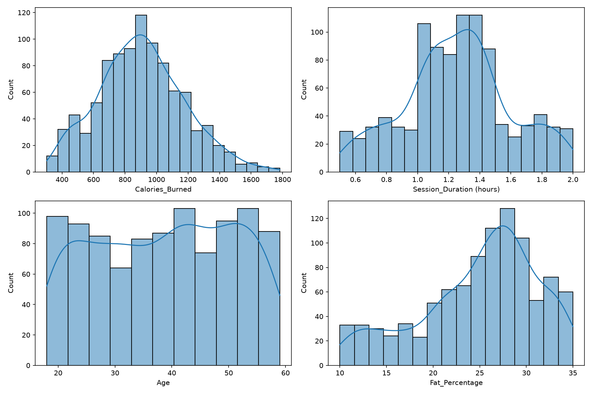
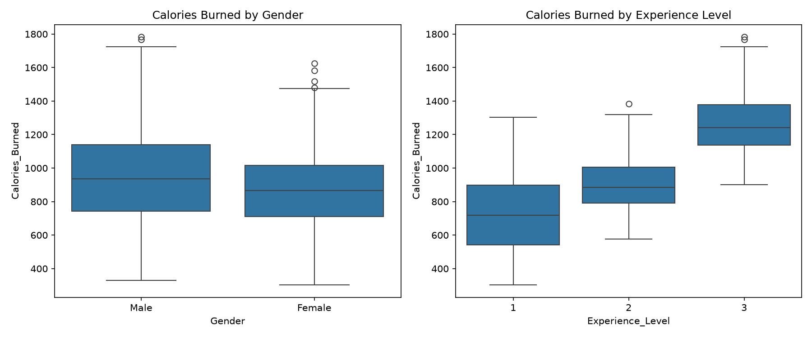
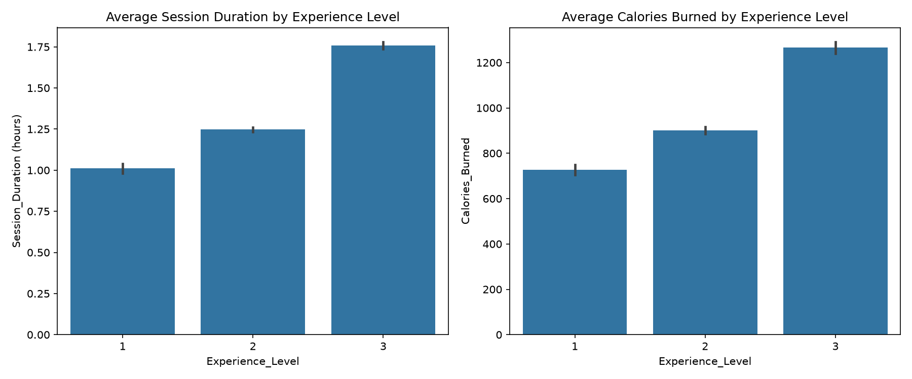
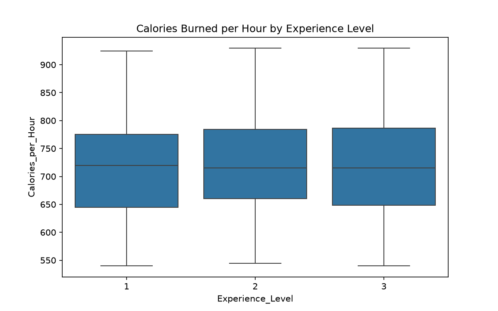
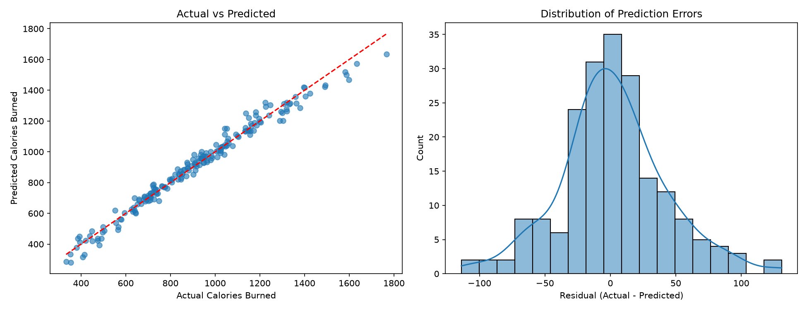

# Gym Performance & Fitness Prediction

A beginner-to-intermediate Data Science project that analyzes gym members' exercise data and builds a regression model to predict calories burned per workout session.

## Project Description

This project explores a real-world-style gym exercise tracking dataset to understand the relationship between physical attributes, workout habits, and calories burned. After exploratory data analysis revealed the dataset does not contain repeated measurements over time for the same individual, the project was scoped around what the data actually supports: predicting **Calories Burned per session** using a regression approach.

## Main Objectives

- Perform thorough data cleaning and quality checks
- Conduct exploratory data analysis (EDA) to uncover relationships in the data
- Identify a realistic, data-supported machine learning problem
- Build and compare regression models
- Interpret model results and communicate findings clearly
- Document limitations honestly

## Technologies Used

- Python 3
- pandas, numpy
- matplotlib, seaborn
- scikit-learn
- joblib

## Dataset Information

- **Source:** Gym Members Exercise Tracking dataset (CSV)
- **Size:** 973 rows, 15 columns
- **Granularity:** One row per gym member (single snapshot, not repeated over time)
- **Key columns:** Age, Gender, Weight, Height, BMI, heart rate metrics (Max/Avg/Resting BPM), Session_Duration, Calories_Burned, Workout_Type, Fat_Percentage, Water_Intake, Workout_Frequency, Experience_Level

No missing values or duplicate rows were found in the dataset.

## Data Science Techniques Used

- Missing value and duplicate checks
- Outlier detection via boxplots
- Correlation analysis and heatmaps
- One-Hot Encoding for categorical variables
- Multicollinearity handling (dropped BMI, derived from Weight/Height)
- Train/test split (80/20)

## Machine Learning Approach

**Problem type:** Regression
**Target variable:** Calories_Burned
**Why this target:** It has strong, explainable relationships with session and physiological data, with no data leakage concerns (all features are known during or before the session).

**Models compared:**
| Model | MAE | RMSE | R² |
|---|---|---|---|
| Linear Regression | 30.39 | 40.81 | 0.9800 |
| Random Forest Regressor | 35.91 | 47.24 | 0.9732 |

**Selected model:** Linear Regression — it performed slightly better than Random Forest and is simpler and more interpretable, indicating the underlying relationship is largely linear.

## Results

- The final Linear Regression model explains **98% of the variance** (R²) in calories burned.
- On average, predictions are off by about **30 calories**, which is small relative to the dataset's range (300–1800 calories).

## Key Findings

- **Session_Duration** is by far the strongest predictor of calories burned (correlation = 0.91, regression coefficient ≈ 713).
- **Gender** has a moderate effect (male members tend to burn somewhat more calories).
- **Workout_Type** (Yoga, HIIT, Cardio, Strength) has minimal effect on calories burned once session duration is accounted for.
- BMI was excluded from modeling since it is mathematically derived from Weight and Height (correlation of 0.85 with Weight), avoiding redundant information.

## Limitations

- The dataset appears to be a single snapshot per member; it does not support tracking performance over time for the same individual.
- The unusually high R² (0.98) suggests this dataset may be synthetically generated, as real-world fitness data typically contains more noise and unexplained variance.
- Findings are based on this dataset only and may not generalize to other gyms or populations.

## Future Improvements

- Validate findings against real-world gym tracking data.
- Incorporate additional features such as workout intensity, heart rate zones, or exercise-specific details.
- Explore time-series tracking if longitudinal data becomes available.

## Dataset License & Attribution

The dataset used in this project is licensed under the **Apache License 2.0**. In compliance with its terms:

- **Attribution:** This project uses the "Gym Members Exercise Tracking" dataset, originally sourced from [https://www.kaggle.com/datasets/valakhorasani/gym-members-exercise-dataset / KAGGLE PAGE HERE]. All credit for the original data collection goes to the original author(s).
- **License:** The dataset's original copyright notice and Apache 2.0 license are preserved in this repository (see `LICENSE` file). This project's own code is also shared under the same Apache 2.0 terms.

See the `LICENSE` file for the full license text.

## Visual Analysis

### Distributions of key variables

### Calories burned by gender and experience level

### Why does experience seem to matter?
Average session duration rises with experience level (1.01, 1.25, and 1.76 hours), and so do average calories (726, 902, and 1265). But calories per hour are almost identical across levels (about 720), so the difference comes from longer sessions, not more intense ones.

### Model evaluation
The predictions follow the ideal line closely and the errors are centered around zero.

